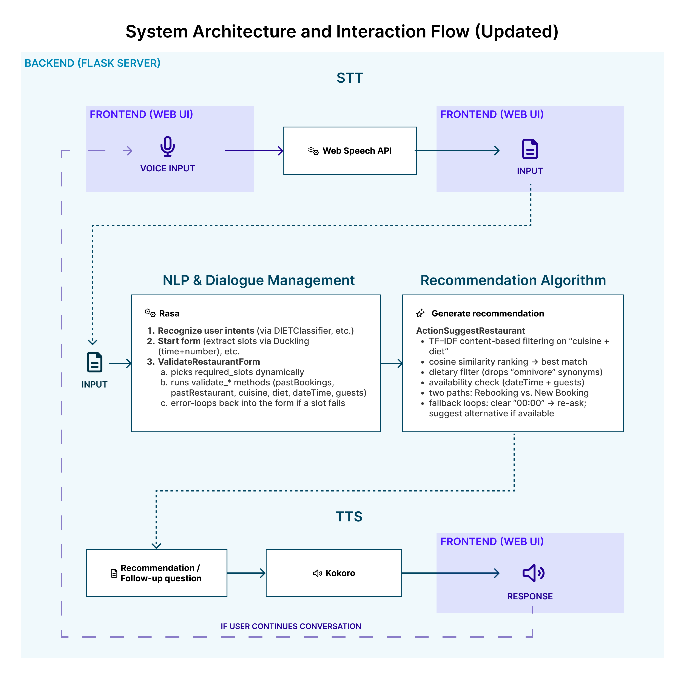

# VoiceAssistantAlice

**A Rasa‑Based Voice Assistant for Restaurant Reservations**

This repository contains all components for a prototype voice assistant that recommends and books restaurants based on user preferences, leveraging TF–IDF content filtering, Duckling for date/time & number parsing, and a web UI for demonstration.

---

## Overview

VoiceAssistantAlice demonstrates an end-to-end conversational AI system built on Rasa. It includes:

* **Custom Form Validation** (`ValidateRestaurantForm`) to collect and validate user slots (cuisine, dietary restrictions, date/time, number of guests, past bookings).
* **Recommendation Engine** (`ActionSuggestRestaurant`) that:

  * Precomputes TF–IDF vectors for each restaurant description.
  * Uses cosine similarity to match user preferences (cuisine + diet).
  * Checks availability based on Duckling‑parsed date/time and guest count.
* **Duckling Integration** for robust natural language date/time & number of guests understanding.
* **Flask App** (`app.py`) as a minimal web interface to demonstrate interactions.
* **Interactive Rasa Shell** for story creation and testing via `rasa interactive`.
* **Automated Preprocessing Script** (`preprocess.py`) to generate and serialize TF–IDF models for fast startup.

All services can be launched via a single script.

## Architecture & Key Components 




---

## Setup & Usage

### 1. Clone & Navigate

```bash
git clone https://github.com/<your-username>/VoiceAssistantAlice.git
cd VoiceAssistantAlice
```

### 2. Create Virtual Environment & Install Dependencies

```bash
python3.10 -m venv va_env
source va_env/bin/activate   # macOS/Linux
# or .\va_env\Scripts\Activate.ps1  # Windows (PowerShell)

pip install -r requirements.txt
```

### 3. Run Duckling

Duckling is required for date/time & number parsing.

```bash
cd duckling
stack build
stack exec duckling-example-exe > ../logs/duckling.log 2>&1 &
cd ..
```

### 4. Preprocess Restaurant Data

Whenever you update `data/restaurants.json`, regenerate TF–IDF:

```bash
python preprocess.py
```

### 5. Launch All Services

#### macOS/Linux

```bash
chmod +x ./start_bot.sh
./start_bot.sh
```

#### Windows (PowerShell)

```powershell
# Activate venv
.\va_env\Scripts\Activate.ps1
# Start Duckling
cd duckling; stack exec duckling-example-exe > ..\logs\duckling.log 2>&1 ; cd ..
# Start Rasa server
rasa run --enable-api --cors "*" > logs\rasa.log 2>&1 &
# Start action server
rasa run actions > logs\actions.log 2>&1 &
# Run Flask app
gunicorn -b 127.0.0.1:5000 app:app > logs\app.log 2>&1 &
```

Open your browser at `http://localhost:5000`.

---

## Testing & Evaluation

### Core (Conversation) Tests

Define conversation test stories in `tests/test_stories.yml` and run:

```bash
rasa test core --stories tests/test_stories.yml
```

### NLU Tests

Define NLU test cases in `data/test_nlu.yml` and run:

```bash
rasa test nlu --nlu data/test_nlu.yml
```

After running, inspect the reports generated under `results/`:

* `results/intent_report.json`  and `results/intent_confusion_matrix.png` for NLU classification metrics and confusion matrix
* `results/DIETClassifier_report.json` and `results/DIETClassifier_confusion_matrix.png` for entity extraction performance.
* `results/story_report.json` & `results/core/failed_test_stories.yml` for conversation‐level accuracy and failed stories


## Demonstration & Evaluation

1. **Web UI / Flask App**: chat + voice at `http://localhost:5000`
2. **Rasa Interactive**: Create and refine stories:

   ```bash
   rasa interactive
   ```
3. **Shell Testing**:

   ```bash
   rasa shell --endpoints endpoints.yml
   ```
4. **Logs**: Check `logs/actions.log` and `logs/rasa.log` for diagnostics.

---

## Live Demo Recording

Watch a live session demonstrating the assistant handling new bookings, rebookings, and cancellations:

<a href="https://www.youtube.com/watch?v=IKRH7u9VYPU" target="_blank">
  
</a><br/>
Link: https://www.youtube.com/watch?v=IKRH7u9VYPU


---

## Privacy Considerations and Future Enhancements

**Privacy in API Integration**

* Minimal data collection (only what's necessary, e.g., location)
* Encrypt all data in transit (TLS) and at rest
* Explicit user consent and opt‑out commands (e.g., "Stop sharing my data")

**Optional UX Features**

* Exit commands (implemented but under refinement) to cancel at any point
* Personalization (remember favorite cuisines)
* Multilingual support with fallbacks to user’s locale

**Risks & Mitigation**

* Privacy: encryption, strict data lifecycle, transparent notices
* Model bias: continuous monitoring, diverse utterance examples
* Complexity: incremental rollout and user acceptance testing

---

## Possible Future Work

* Dynamic data backend (database instead of JSON)
* Voice activation keywords and enhanced front‑end (loading spinners)
* User profiles for long‑term personalization
* Location-based restaurant suggestions via external APIs
* Automated booking confirmations (email/SMS)
* Sentiment-aware recommendations for context‑aware suggestions
